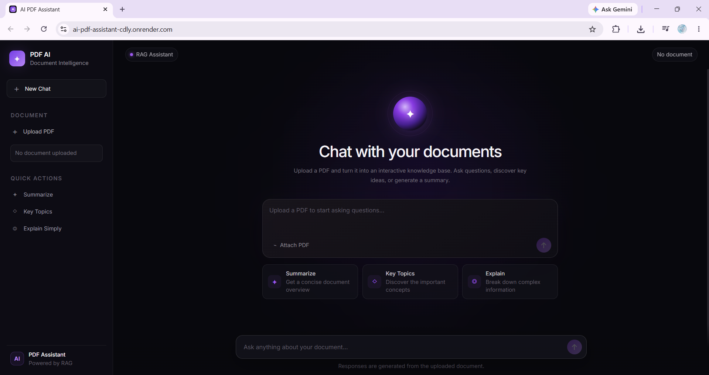

# 📄 AI PDF Assistant

An AI-powered PDF assistant that allows users to upload documents and interact with them using natural language.

The application uses **Retrieval-Augmented Generation (RAG)** to retrieve relevant information from uploaded PDFs and generate grounded answers with source page citations.

🌐 **Live Demo:** https://ai-pdf-assistant-cdly.onrender.com/

---

## ✨ Features

- 📤 Upload and process PDF documents
- 💬 Ask natural-language questions about the uploaded document
- 🔎 Retrieval-Augmented Generation (RAG)
- 🧠 Conversational context for follow-up questions
- 📄 Source page citations in generated answers
- ✨ Whole-document summarization
- 🔍 Hybrid retrieval using semantic search and BM25
- ⚡ Cached vector embeddings for previously processed documents
- 🌐 FastAPI-powered backend
- 🎨 Responsive web interface
- ☁️ Deployed on Render

---

## 🖼️ Preview



---

## 🧠 How It Works

```text
                    PDF Upload
                        │
                        ▼
                  PDF Extraction
                        │
                        ▼
                  Text Chunking
                        │
                        ▼
                Google Embeddings
                        │
                        ▼
                    ChromaDB
                        │
              ┌─────────┴─────────┐
              ▼                   ▼
       Semantic Search        BM25 Search
              │                   │
              └─────────┬─────────┘
                        ▼
                Hybrid Retrieval
                        │
                        ▼
               Relevant Context
                        │
                        ▼
                    Groq LLM
                        │
                        ▼
              Grounded Response
                        │
                        ▼
                 Source Citations
```

When a user uploads a PDF, the document is extracted and split into smaller chunks. Embeddings are generated for those chunks and stored in ChromaDB.

For a question, the application retrieves relevant document chunks using both semantic vector search and BM25 keyword retrieval. The retrieved context is then provided to the language model to generate a document-grounded response.

The application also maintains conversational context so follow-up questions can be understood correctly.

---

## 🛠️ Tech Stack

### AI / RAG

- LangChain
- Groq
- Google Generative AI Embeddings
- ChromaDB
- BM25

### Backend

- Python
- FastAPI
- Uvicorn

### Frontend

- HTML
- CSS
- JavaScript

### Deployment

- Render

---

## 📁 Project Structure

```text
ai-pdf-assistant/
│
├── data/
│
├── src/
│   ├── chatbot.py
│   ├── embeddings.py
│   ├── file_hash.py
│   ├── pdf_loader.py
│   ├── rag_chain.py
│   ├── retriever.py
│   ├── summarizer.py
│   ├── text_splitter.py
│   └── vector_store.py
│
├── static/
│   ├── index.html
│   ├── script.js
│   ├── style.css
│   └── favicon.svg
│
├── app.py
├── web_app.py
├── requirements.txt
├── .gitignore
└── README.md
```

---

## 🚀 Running Locally

### 1. Clone the repository

```bash
git clone https://github.com/Jyothi-Sumitra/ai-pdf-assistant.git
cd ai-pdf-assistant
```

### 2. Create a virtual environment

```bash
python -m venv .venv
```

Activate it on Windows:

```bash
.venv\Scripts\activate
```

### 3. Install dependencies

```bash
pip install -r requirements.txt
```

### 4. Configure environment variables

Create a `.env` file in the project root:

```env
GROQ_API_KEY=your_groq_api_key
GOOGLE_API_KEY=your_google_api_key
```

> Never commit your `.env` file or API keys to GitHub.

### 5. Start the application

```bash
uvicorn web_app:app --reload
```

Then open:

```text
http://127.0.0.1:8000
```

---

## 💡 Example Questions

After uploading a PDF, users can ask questions such as:

```text
What is this document about?

Summarize this document.

What are the key topics?

Explain the main ideas in simple terms.

What does the document say about this topic?
```

The assistant retrieves relevant information from the uploaded document and provides an answer based on that context.

---

## 🔐 Security

API keys and other secrets are stored using environment variables and are excluded from version control through `.gitignore`.

Uploaded documents and generated vector database files are also excluded from the repository.

---

## 🌐 Live Demo

Try the deployed application:

**https://ai-pdf-assistant-cdly.onrender.com/**

> The application is hosted on Render's free tier, so the first request after a period of inactivity may take additional time while the service starts.

---

## 📌 Future Improvements

Potential future improvements include:

- Support for multiple documents
- Streaming responses
- Improved reranking and retrieval evaluation
- Persistent user sessions
- Support for additional document formats

---

## 👩‍💻 Author

Built as a hands-on Generative AI project exploring **RAG, embeddings, vector databases, hybrid retrieval, conversational AI, FastAPI, and LLM application deployment**.